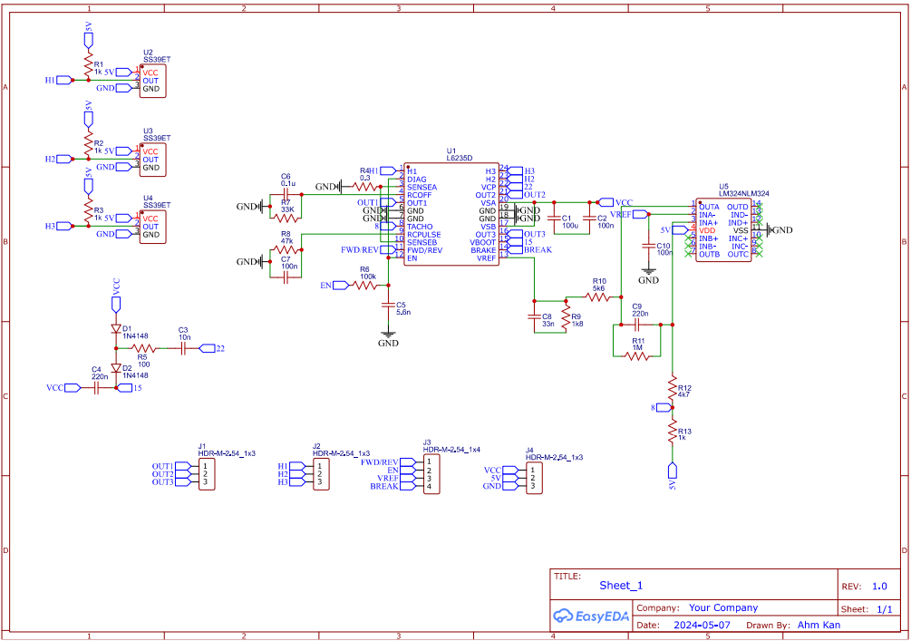

# Custom-BLDC-Motor-Controller
This project is a custom-designed BLDC motor controller PCB, built using EasyEDA, and tailored for precise alignment with a specific BLDC motor.

🔧 Features
Motor Driver: Integrated L6235D three-phase BLDC driver

Sensor Feedback: 3x Hall effect sensor inputs for rotor position detection

Microcontroller Interface: I/O pin header to connect an external MCU

Form Factor: Board dimensions specifically matched to motor housing to ensure accurate sensor positioning

📷 Preview
Insert image or 3D render of your PCB here if available

🛠️ Tools Used
PCB Design: EasyEDA

Target Application: Motor control projects, robotics, educational platforms

🚀 Status
✅ PCB Designed

🧪 Testing in progress

📦 Open for contributions, improvements, and testing suggestions

📬 Contact
Feel free to reach out or open an issue if you have questions, suggestions, or collaboration ideas!
